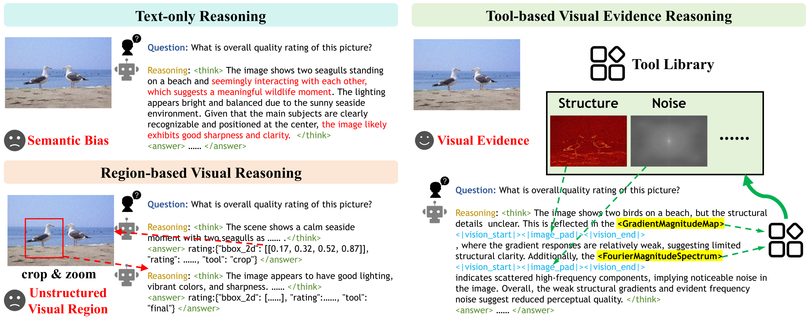

<div align="center">

# [ECCV 2026] IQA-T1: Tool-based Visual Evidence Reasoning for Image Quality Assessment

This is the official repository for IQA-T1.

[](https://arxiv.org/abs/your-paper-id)
[](https://huggingface.co/zibuyu-02/IQA-T1)
[](https://huggingface.co/datasets/zibuyu-02/Q-Tool)
\
[](https://code.visualstudio.com/)
[](https://opensource.org/licenses/MIT)

</div>

## 📰 News
- **[2026-7-14]** 🔥 We release the **Model** publicly on [HuggingFace](https://huggingface.co/zibuyu-02/IQA-T1) and [Baidu Netdisk](https://pan.baidu.com/s/1jeOrTOY1X1loEhNpJKjixQ?pwd=ejf9).
- **[2026-7-10]** 🔥 We release the **Dataset** publicly on [HuggingFace](https://huggingface.co/datasets/zibuyu-02/Q-Tool) and [Baidu Netdisk](https://pan.baidu.com/s/1aSJ4eg4QMAtQPoDwbgnZCA?pwd=2k4m).
- **[2026-06-18]** 🚀 Our paper is accepted by **ECCV 2026**.
---

## 🔭 **Motivation**
- Existing VLM-based IQA methods mainly rely on **text-only** reasoning or **region-based** reasoning, which suffer from semantic bias or lack explicit perceptual interpretation. 
- IQA-T1 introduces a new paradigm of **tool-based visual evidence reasoning** for image quality assessment.



## 📁 Repository Structure
- For training, download the [dataset](https://pan.baidu.com/s/1aSJ4eg4QMAtQPoDwbgnZCA?pwd=2k4m) and place it in dataset/, and download the [Qwen3-VL-4B](https://huggingface.co/Qwen/Qwen3-VL-4B-Instruct) to the root directory.
- For inference, download the **IQA-T1** [model checkpoint](https://pan.baidu.com/s/1jeOrTOY1X1loEhNpJKjixQ?pwd=ejf9) and place it in saves/.

```
IQA-T1/          
├── dataset/                      
│   └── KONIQ/                         
│       ├── koniq/                         # Original KonIQ images
│       ├── tools/                         # Pre-computed tool images
│       └── metas/                         # Dataset metadata files
├── saves/                      
│   └── qwen3-vl-4B-Instruct-all-GRPO-v3/
├── Qwen3-VL-4B-Instruct/ 
├── train/ 
├── inference/
├── scripts/       
├── train_qwen3vl_iqa_sft-4b.sh            # SFT training script
├── train_qwen3vl_iqa_grpo-4b.sh           # GRPO training script
├── infer_qwen3vl_iqa.sh                   # IQA-T1 inference script
└── ...
```

---

## 🛠️ Environment Setup

SFT and GRPO stages use **two separate conda environments** for dependency compatibility. We provide pre-exported environment files.

```bash
git clone https://github.com/zibuyu-02/IQA-T1.git
cd IQA-T1

# SFT environment (Stage 1)
conda env create -f environment_sft.yaml

# GRPO environment (Stage 2 + Inference)
conda env create -f environment_grpo.yaml
```

| File | Purpose | Key Packages |
|---|---|---|
| `environment_sft.yaml` | SFT training | PyTorch 2.6, DeepSpeed, Transformers |
| `environment_grpo.yaml` | GRPO training & Inference | PyTorch 2.8, vLLM 0.11, Ray |

---

## 🧠 **Training**

### 🎓 Stage 1: Supervised Fine-Tuning (SFT)

1. Download the [Q-Tool dataset](https://huggingface.co/datasets/zibuyu-02/Q-Tool) and place it in `dataset/KONIQ/`.

2. Download the base model [Qwen3-VL-4B-Instruct](https://huggingface.co/Qwen/Qwen3-VL-4B-Instruct) to the root directory.

3. Activate the SFT environment:

   ```bash
   conda activate tools   # created from environment_sft.yaml
   ```

4. Launch SFT training from the IQA-T1 root directory:

   ```bash
   bash train_qwen3vl_iqa_sft-4b.sh
   ```

### 🎓 Stage 2: Reinforcement Learning (GRPO)

1. Ensure the SFT checkpoint from Stage 1 is at `saves/qwen3-vl-4B-Instruct-all-SFT/`. Update the `MODEL_PATH` in `train_qwen3vl_iqa_grpo-4b.sh` if you renamed the checkpoint.

2. Activate the GRPO environment:

   ```bash
   conda activate verl  # created from environment_grpo.yaml
   ```

3. Launch GRPO training from the IQA-T1 root directory:

   ```bash
   bash train_qwen3vl_iqa_grpo-4b.sh
   ```
---

## ⚡ Quick Start
### Inference

1. Download the **IQA-T1** [model checkpoint](https://huggingface.co/zibuyu-02/IQA-T1) and place it in `saves/`.

2. Set the image path and model path in `infer_qwen3vl_iqa.sh`, then run from the IQA-T1 root directory:

   ```bash
   bash infer_qwen3vl_iqa.sh
   ```

   Or override via environment variables:

   ```bash
   IMAGE_PATH=/path/to/your/image MODEL_PATH=/path/to/your/model bash infer_qwen3vl_iqa.sh
   ```

3. Results are saved to `result/result.json`, and visual evidence images are saved to `result/{image_name}/`.

---

## ⭐ Citation

If you find IQA-T1 useful for your research and applications, please cite using this BibTeX:

```latex
@inproceedings{wu2026iqat1,
  title={IQA-T1: Tool-based Visual Evidence Reasoning for Image Quality Assessment},
  author={Wu, Jinjian and Tang, Jiaqi and Wei, Wei and Yan, Yingying and Chen, Jianmin and Geng, Botong and Zhang, Lei and Chen, Qifeng},
  booktitle={European Conference on Computer Vision (ECCV)},
  year={2026}
}
```

## 🤝 Acknowledgements

This work was supported in part by the National Natural Science Foundation of China (No. 62472359, No. 62372379), in part by Xi’an’s Key Industrial Chain Core Technology Breakthrough Project: AI Core Technology Breakthrough under Grand 24ZDCYJSGG0003, and in part by the Hong Kong University of Science and Technology under Grant No. WEB26EG02.\
We also thank the authors of [LLaMA-Factory](https://github.com/hiyouga/LLaMA-Factory), [EasyR1](https://github.com/hiyouga/EasyR1), and [Qwen3-VL](https://github.com/QwenLM/Qwen3-VL) for their contributions. Our modified versions extend these frameworks with tool-based reasoning capabilities for IQA.
